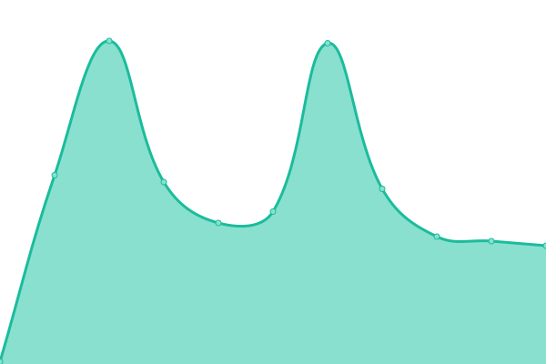
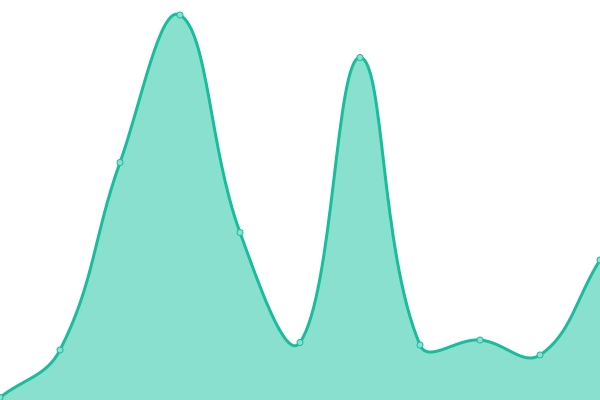
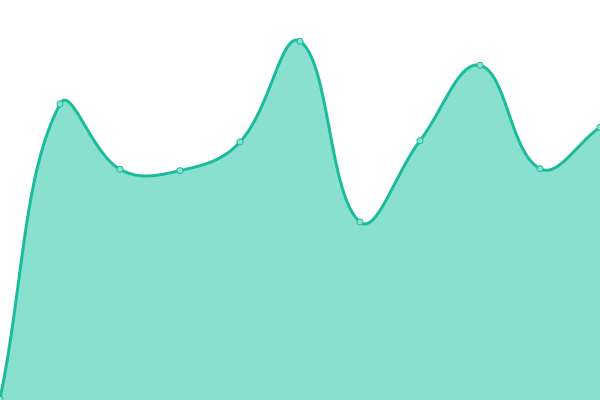
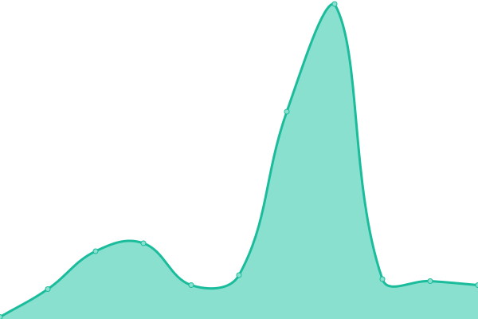

## 📈 Live Status: <!--live status-->

<!--start: status pages-->
<!-- This summary is generated by Upptime (https://github.com/upptime/upptime) -->
<!-- Do not edit this manually, your changes will be overwritten -->

| URL                                             | Status  | History                                                                                      | Response Time                                                                    | Uptime                                                                                                                                                                                                           |
| ----------------------------------------------- | ------- | -------------------------------------------------------------------------------------------- | -------------------------------------------------------------------------------- | ---------------------------------------------------------------------------------------------------------------------------------------------------------------------------------------------------------------- |
| [Google](https://www.google.com)                | 🟩 Up   | [google.yml](https://github.com/upptime/upptime/commits/master/history/google.yml)           |  88ms       |            |
| [Wikipedia](https://en.wikipedia.org)           | 🟩 Up   | [wikipedia.yml](https://github.com/upptime/upptime/commits/master/history/wikipedia.yml)     |  140ms   |      |
| [Hacker News](https://news.ycombinator.com)     | 🟩 Up   | [hacker-news.yml](https://github.com/upptime/upptime/commits/master/history/hacker-news.yml) |  337ms |  |
| [Broken Site](https://thissitedoesnotexist.com) | 🟥 Down | [broken-site.yml](https://github.com/upptime/upptime/commits/master/history/broken-site.yml) |  0ms   |    |
| Secret Site                                     | 🟩 Up   | [secret-site.yml](https://github.com/upptime/upptime/commits/master/history/secret-site.yml) |  50ms  |  |

<!--end: status pages-->
